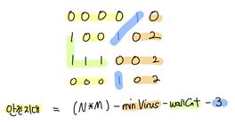

# 연구소

## 풀이방법

일단 벽을 3개는 무조건 세워야 하니까 벽을 세울 수 있는 조합을 찾기 위해 `combinations`을 사용했다.

그리고 해당 조합들을 바탕으로 벽을 세운 뒤 해당 `board`를 bfs를 수행하고, 이때의 반환 값으로 virus를 만들 수 있는 수를 반환하기로 했다.(이때, 이전에 기억하고 있는 virus보다 많이 만들어진다면 종료)

마지막으로, 안전한 지역인 0은 `전체지역(N*M) - 임의의 벽 3개를 세웠을때 바이러스의 최소 숫자(minVirus)-원래 벽의 수(wallCnt)-3(임의로 벽 3개)`이 된다.

예제2를 예시로 들면 아래와 같다.

## 느낀점

이러한 방식으로 풀면 3636ms로 통과한다.

그런데, Python3로 통과한 사람 중 가장 효율적으로 푼 사람이 368ms이다.

좀 더 효율적으로 구현할 수 있도록 고민해봐야겠다.